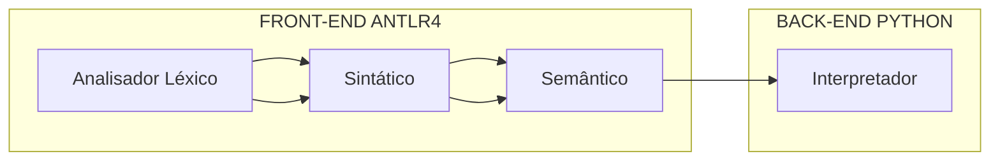

# LOT - Linguagem orientada a testes


## 1. Proposta da linguagem

O LOT é uma linguagem de programação feita para facilitar a execução de testes de software. Ele foi criado com o objetivo de tornar o processo de desenvolvimento de software mais rápido e eficiente, permitindo de maneira fácil a criação de alguns testes unitários para diversas linguagens de programação, seja um script avulso ou um servidor web. A linguagem é independente de sistemas operacionais, pois utiliza as bibliotecas nativas da linguagem python  para a chamada do sistema operacional.


## 2. Estrutura do processo de execução
LOT é uma linguagem de programação interpretada, seguindo o fluxo Analisador Léxico-Sintático-Semântico. Após a validação do código fonte pelo front-end do LOT, a árvore gramatical gerada é interpretada pelo interpretador escrito em Python, que utiliza o sistema operacional através de bibliotecas nativas do python como sys, os, subprocess, etc. para executar os testes em diferentes linguagens de programação como python, node, etc... 


## 3. Estrutura da linguagem
A LOT é uma linguagem que permite a criação de objetos, que carregam informações sobre o tipo daquele objeto, que pode ser um servidor ou um script. Dependendo do tipo, o objeto pode PRECISA carregar alguns parâmetros, principalmente para o servidor, que precisa carregar o framework (FASTAPI, EXPRESS, etc...) e o arquivo principal (app.py, index.js, etc... ) que será executado. Path é o caminho onde o arquivo principal será carregado.

```
object App {
  type: server;
  language: python;
  framework: fastapi;
  mainFile: app;
  path: ./pastaFastapiServer;
};

```
Neste exemplo, o objeto App é do tipo server, que é um servidor web, e o arquivo principal é app.py, que é um arquivo python. O caminho é ./pastaFastapiServer, que é a pasta onde o arquivo app.py será carregado. Apesar de na estrutura definida da linguagem como opcionais, o analisador semântico do LOT se os campos necessários para aquele tipo são preenchidos. 

Para scripts avulsos, o objeto é do tipo script, sendo necessário informar o arquivo principal, que será executado, além de seu caminho onde será carregado. Especificar a linguagem é fundamental para que o interpretador possa executar o script, pois executará um comando de acordo com cada liguagem, por exemplo, <code>python scriptTeste.py</code> para python e <code>node scriptTeste.js</code> para node.

```
object ScriptTest {
  type: script;
  language: python;
  mainFile: scriptTeste;
  path: ./pastaScript;  
};
```


## 4. Executando testes com LOT

Após a criação dos objetos, é possível realizar a execução daquele objeto com o comando <code>test run</code> para executar apenas um teste unitário ou <code>test runBulk</code> para executar vários testes unitários.

#### 4.1 A estrutura do comando <code>test</code>

O comando <code>test</code> é composto pelo termo <code>test</code>, seguido pelo tipo de teste, que pode ser <code> run </code> ou <code> runBulk </code> seguido pelo nome do objeto, ou, no caso do RunBulk, uma série de objetos (Não importa o tipo de objeto) e por último, pelos parâmetros dos testes unitários.

```
test runBulk App  ScriptTest  ScriptTesttwo serveports: [8000] args: [ [1,2] ]  serverApps : [ app ] ;
```

#### 4.2 Parâmetros dos testes unitários

Os parâmetros dos testes unitários são:

- <code>serveports</code>: é um array de números inteiros, que são os ports dos servidores que serão executados. 
- <code>serverApps</code>: é um array de strings, que são os nomes dos objetos que serão executados. 
- <code>args</code>: é um array de arrays de strings, que são os argumentos que serão passados para o objeto.


### 4.3 Rodando o código fonte

Todo o código da linguagem é escrito em um arquivo de texto txt. Logo após a criação do arquivo, é possível rodar o comando <code>python main.py ./teste.txt</code> para executar o arquivo passando como parâmetro o caminho do arquivo a ser processado pelo processo de análise léxico-sintático-semântico e posteriormente rodando o código pelo interpretador. 


 
