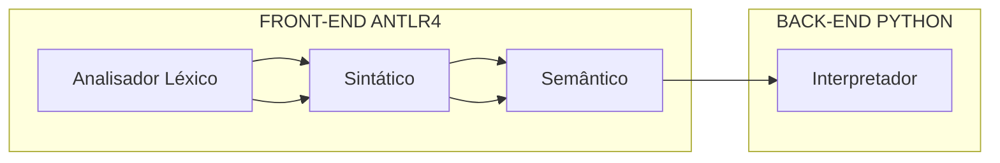

# LOT - Linguagem orientada a testes

## Desenvolvedores do projeto:
Escola Politécnica de Pernambuco (POLI/UPE)  
Estudantes: Jean Felipe Morais de Oliveira, Marina Mendonça Jatobá, Pedro Henrique Bezerra de Mello e Rodrigo Campos de Oliveira Cabral  
Disciplina: Compiladores  
Professor: Luis Carlos  

## 1. Proposta da linguagem

A LOT é uma linguagem de programação feita para facilitar a execução de testes de software. Ela foi criada com o objetivo de tornar o processo de desenvolvimento de software mais rápido e eficiente, permitindo de maneira fácil a criação de alguns testes unitários para diversas linguagens de programação, seja um script avulso ou um servidor web. A linguagem é independente de sistemas operacionais, pois utiliza as bibliotecas nativas da linguagem python para a chamada do sistema operacional.


## 2. Estrutura do processo de execução
LOT é uma linguagem de programação interpretada, seguindo o fluxo Analisador Léxico-Sintático-Semântico. Após a validação do código fonte pelo front-end do LOT, a árvore gramatical gerada é interpretada pelo interpretador escrito em Python, que utiliza o sistema operacional através de bibliotecas nativas do python como sys, os, subprocess, etc. para executar os testes em diferentes linguagens de programação como python, node, etc... 


```mermaid
flowchart LR
    A[Analisador Léxico] --> B[Sintático] --> C[Semântico]
    subgraph FRONT-END ANTLR4
        A --> B --> C
    end
    C --> D[Interpretador]
    subgraph BACK-END PYTHON
        D
    end
```
## 3. Estrutura da linguagem
A LOT é uma linguagem que permite a criação de objetos, que carregam informações sobre o tipo daquele objeto, que pode ser um servidor ou um script. Dependendo do tipo, o objeto precisa carregar alguns parâmetros, principalmente para o servidor, que precisa carregar o framework (FASTAPI, EXPRESS, etc...) e o arquivo principal (app.py, index.js, etc... ) que será executado. Path é o caminho onde o arquivo principal será carregado.

```
object FastAPIServer {
  type: server;
  language: python;
  framework: fastapi;
  mainFile: app;
  path: ./pastaFastapiServer;
};

```
Neste exemplo, o objeto FastAPIServer é do tipo server, que é um servidor web, e o arquivo principal é app.py, que é um arquivo python. O caminho é ./pastaFastapiServer, que é a pasta onde o arquivo app.py será carregado. Apesar de na estrutura definida da linguagem como opcionais, o analisador semântico do LOT checa se os campos necessários para aquele tipo são preenchidos. 

Para scripts avulsos, o objeto é do tipo script, sendo necessário informar o arquivo principal, que será executado, além de seu caminho onde será carregado. Especificar a linguagem é fundamental para que o interpretador possa executar o script, pois executará um comando de acordo com cada liguagem, por exemplo, <code>python scriptTeste.py</code> para python e <code>node scriptTeste.js</code> para node.

```
object ScriptTest {
  type: script;
  language: python;
  mainFile: scriptTeste;
  path: ./pastaScript;  
};
```

## 3.1 Gramática ANTLR da linguagem LOT

A gramática ANTLR 4 da linguagem LOT pode ser encontrada no arquivo Expr.g4.

Basicamente, a linguagem começa com uma estrutura chamada document, que é composta por uma ou mais  declarações, que podem ser objetos ou testes. 
```
document:
    (decs+=declaration+) EOF;
  ```

Sintáticamente falando, uma declaração (declaration) pode ser um ObjectDeclaration ou um TestDeclaration, sendo o ObjectDeclaration o definidor de um objeto e o TestDeclaration o definidor de um teste unitário.

```
declaration:
        'object' objectName=ID '{'
            'type' ':' type=TYPES ';'
            ('language' ':' language=LANGUAGES ';' )?
            ('framework'  ':' server=FRAMEWORKSERVER ';')?
            ('mainFile' ':' mainFile=ID ';')?
            ('path' ':' path=PATH ';')?
        '}' ';' #objectDeclaration
    |
        'test' TYPETEST objectName+=ID (((',' objectName+=ID) | (objectName+=ID))*) (testargs+=testArguments)* ';' #testDeclaration
    ;
```

Nos testDeclarations preciamos definir primeiramente o tipo do teste, que pode ser run ou runBulk; Run seria para executar apenas UM teste unitário, enquanto runBulk seria para executar vários testes unitários.

```
TYPETEST: 'run' | 'runBulk';
```

Após o tipo do teste, definimos o(s) nome(s) do(s) objeto(s) que será(ão) executado(s), que pode ser um objeto do tipo server ou script. 

```
objectName+=ID (((',' objectName+=ID) | (objectName+=ID))*)
```

Por último, os parâmetros dos testes unitários são passados como listas dentro de colchetes após o nome dos objetos:
```
testArguments:
    'serverports' ':' '[' serverports+=INT ']' #serverPorts |
    'serverApps' ':' '[' serverapps+=ID ']' #serverApps |
    argsValues = argsSpec #args |
    argsValues = argsBulkSpec #argsBulk;

```

- <code>serverports</code>: é um array de números inteiros, que são os ports dos servidores que serão executados. Ex.: 3000, 8000. 
- <code>serverApps</code>: é um array de strings, que definem o nome da instância da aplicação (variável <code>app</code>) dentro do arquivo Python. É obrigatório para testes nos servidores FastAPI, mas dispensáveis para Express ou scripts. 
- <code>args</code>: é um array de arrays de strings, que são os argumentos que serão passados para o objeto. Definirá os inputs do teste, e o formato exato depende do modo do teste que está sendo executado.


## 3.2 O arquivo main.py
Ao executar o main.py, ativará o dunder-main do arquivo, contendo sempre a esturura 
``` 
python main.py ./<NOME_DO_ARQUIVO_DE_ENTRADA>
```
Caso não haja nenhum arquivo de entrada, será exibido o seguinte erro:
```
Uso: python main.py <arquivo_de_entrada>
```

O fluxo de análise léxico-sintático é realizado pela função parse_file, que recebe como parâmetro o arquivo de entrada na forma de FileStream, gerando primeiramente os tokens (token_stream) e caso haja erros, a classeCollectingErrorListener é utilizada para capturar os erros do programa. 

O mesmo processo se repete para o parser, que recebe o stream de tokens e gera a árvore de parse (tree). Caso haja erros, a classe CollectingErrorListener é utilizada para capturar os erros do programa.

A classe ExprSemanticAnalyser é responsável por realizar a análise semântica do código fonte, que é feita através da função analise, que recebe como parâmetro a árvore gerada pelo parser.

O interpretador é executado pela classe ExprInterpreter, que recebe como parâmetro a árvore gerada pelo parser. Vale lembrar que como a árvore gerada pelo parser é gerada por uma classe, as informações dos objetos e suas variáveis persistem e servem de base para a execução do interpretador, que é responsável por realizar a execução dos testes unitários.

## 4. Executando testes com LOT

Após a criação dos objetos, é possível realizar a execução daquele objeto com o comando <code>test run</code> para executar apenas um teste unitário ou <code>test runBulk</code> para executar vários testes unitários.

#### 4.1 A estrutura do comando <code>test</code>

O comando se divide em três partes principais: o modo de execução do teste, a lista de objetos e a seção de parâmetros opcionais.
```
test (run|runBulk) NomeDosObjetos [NomeDosObjetos]* (serverports:[...])? (serverApps:[...])? (args:[...])?;
```


#### 4.2 Exemplos de uso

#### A) Testando um script simples (Python ou Node):
- O objetivo é verificar se o script é executado corretamente e se ele recebe os argumentos de linha de comando esperados.
```
// O objeto ScriptTest deve ter type: script na sua definição
test run ScriptTest args:[MundoLOT];
```
Executa o script ScriptTest passando a string <code>MundoLOT</code> como argumento de entrada. O script captura este valor (via sys.argv[1] se for Python, ou process.argv[2] se for Node) e o utiliza para personalizar a mensagem de saída.

#### B) Testando um servidor Express (Node.js):
- Inicia o servidor na porta <code>3000</code> e verifica se as rotas <code>/health</code> e <code>/users</code> respondem com sucesso (HTTP 200):
- É necessário instalar o Express para poder rodar esse teste: <code>npm install express</code>
```
// O servidor Express não precisa do parâmetro 'serverApps'.
test run ExpressServer 
    serverports: [3000] 
    args: [/health, /users];
```

#### C) Execução em Lote (runBulk):
- Executa múltiplos objetos em sequência. A ordem dos argumentos nos arrays deve corresponder exatamente à ordem dos objetos:
 ```
test runBulk FastAPIServer ScriptTest ScriptTesttwo 
    serverports: [8000] 
    args: [ [/abc, /]];
    // Argumentos alinhados: 
    // 1. FastAPIServer -> Recebe [/abc, /] como rotas
    // 2. ScriptTest -> Sem argumentos (retorna erro por não identificar sys.argv[1])
    // 3. ScriptTesttwo -> Sem argumentos
    serverApps: [app]
```
## 5. Detalhando a Funcionalidade de Teste de Rotas
- Quando o objeto testado é um servidor <code>(type: server)</code>, o parâmetro <code>args</code> é utilizado para fornecer uma lista de endpoints que o LOT deve acessar via requisição HTTP GET para verificar se a infraestrutura está funcional.

#### 5.1 Estrutura Esperada das Rotas (Router Testing):
- O handler de teste do servidor, seja ele o handlerExpressRunTest ou o bloco de FastAPI, executa as seguintes etapas para cada rota fornecida:

1. Montagem da URL: O sistema utiliza http://127.0.0.1:[PORTA][ROTA_DO_ARGS]

2. Requisição: Envia um HTTP GET para a URL montada.

3. Validação: O teste é considerado APROVADO se o servidor retornar um código de status correspondente como <code>200</code>.

#### 5.2 Exemplo de configuração com FastAPI (Python):
- Antes de tudo, para o teste funcionar, o arquivo <code>app.py</code> do FastAPI deve ter as rotas definidas, conforme o exemplo ilustrado:
 ```
./pastaFastapiServer/app.py

from fastapi import FastAPI

# Esta é a instância 'app' referenciada em serverApps
app = FastAPI(title="FastAPIServer")

@app.get("/")
def read_root():
    return {"status": "ok"}

@app.get("/health")
def health():
    return {"status": "healthy"}

# Rota que não deve ser aprovada se testada, pois nosso handler só sabe trabalhar com requisições GET.
@app.post("/submit")
def submit():
    return {"message": "received"}

```
- Agora, basta rodar a DSL para obter os resultados:

```
test run FastApiObject 
    serverports: [8000] 
    serverApps: [app] 
    args: [/, /health]; // Rotas que serão acessadas
```

### 6. Rodando o código fonte
- Instale o Express via <code>npm install express</code> para conseguir rodar os teste dele.
- Utilize o comando <code>pythom main.py teste.txt</code> para rodar o projeto.
- Todo o código da linguagem é escrito em um arquivo de texto <code>teste.txt</code>, onde se definem os objetos e os comandos de testes a serem executados.
-  Os arquivos Lexer e Parser do ANTLR4 já estão compilados no diretório, então não precisamos instalar os pacotes do ANTLR4.


 
