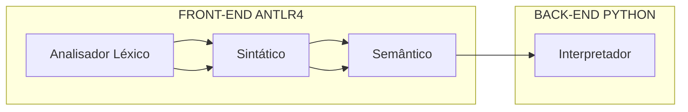

# LOT - Linguagem orientada a testes


## 1. Proposta da linguagem

A LOT é uma linguagem de programação feita para facilitar a execução de testes de software. Ela foi criada com o objetivo de tornar o processo de desenvolvimento de software mais rápido e eficiente, permitindo de maneira fácil a criação de alguns testes unitários para diversas linguagens de programação, seja um script avulso ou um servidor web. A linguagem é independente de sistemas operacionais, pois utiliza as bibliotecas nativas da linguagem python  para a chamada do sistema operacional.


## 2. Estrutura do processo de execução
LOT é uma linguagem de programação interpretada, seguindo o fluxo Analisador Léxico-Sintático-Semântico. Após a validação do código fonte pelo front-end do LOT, a árvore gramatical gerada é interpretada pelo interpretador escrito em Python, que utiliza o sistema operacional através de bibliotecas nativas do python como sys, os, subprocess, etc. para executar os testes em diferentes linguagens de programação como Python e Node. 


```mermaid
flowchart LR
    A[Analisador Léxico] --> B[Sintático] --> C[Semântico]
    subgraph FRONT-END ANTLR4
        A --> B --> C
    end
    C --> D[Interpretador]
    subgraph BACK-END PYTHON
        D
    end
```
## 3. Estrutura da linguagem
A LOT é uma linguagem que permite a criação de objetos, que carregam informações sobre o tipo daquele objeto, que pode ser um servidor ou um script. Dependendo do tipo, o objeto precisará carregar alguns parâmetros, principalmente para o servidor, que necessita carregar o framework (FASTAPI, EXPRESS, etc...) e o arquivo principal (app.py, index.js, etc... ) que será executado. Path é o caminho onde o arquivo principal será carregado.

```
object App {
  type: server;
  language: python;
  framework: fastapi;
  mainFile: app;
  path: ./pastaFastapiServer;
};

```
Neste exemplo, o objeto App é do tipo server, que é um servidor web, e o arquivo principal é app.py, que é um arquivo python. O caminho é ./pastaFastapiServer, que é a pasta onde o arquivo app.py será carregado. Embora alguns campos sejam definidos como opcionais na gramática, o analisador semântico do LOT garante que todos os parâmetros obrigatórios para o tipo de objeto declarado sejam fornecidos na hora da execução do teste.

Para scripts avulsos, o objeto é do tipo script, sendo necessário informar o arquivo principal, que será executado, além de seu caminho onde será carregado. Especificar a linguagem é fundamental para que o interpretador possa executar o script, pois executará um comando de acordo com cada liguagem, por exemplo, <code>python scriptTeste.py</code> para Python e <code>node scriptTeste.js</code> para Node.

```
object ScriptTest {
  type: script;
  language: python;
  mainFile: scriptTeste;
  path: ./pastaScript;  
};
```


## 4. Executando testes com LOT

Após a criação dos objetos, é possível realizar a execução daquele objeto com o comando <code>test run</code> para executar apenas um teste unitário ou <code>test runBulk</code> para executar vários testes unitários.

#### 4.1 A estrutura do comando <code>test</code>

O comando se divide em três partes principais: o modo de execução do teste, a lista de objetos e a seção de parâmetros opcionais.
```
test (run|runBulk) NomeDosObjetos [NomeDosObjetos]* (serverports:[...])? (serverApps:[...])? (args:[...])?;
```

#### 4.2 Parâmetros dos testes unitários

Os parâmetros dos testes unitários são passados como listas dentro de colchetes após o nome dos objetos:

- <code>serverports</code>: é um array de números inteiros, que são os ports dos servidores que serão executados. Ex.: 3000, 8000. 
- <code>serverApps</code>: é um array de strings, que definem o nome da instância da aplicação (variável <code>app</code>) dentro do arquivo Python. É obrigatório para testes nos servidores FastAPI, mas dispensáveis para Express ou scripts. 
- <code>args</code>: é um array de arrays de strings, que são os argumentos que serão passados para o objeto. Definirá os inputs do teste, e o formato exato depende do modo do teste que está sendo executado.

> Nota sobre o <code>args</code>:
> - Para Scripts (type: script): os valores são passados como argumentos de linha de comando. Ex.: <code>python script.py arg1 arg2</code>.
> - Para Servidores (type: server): os valores são interpretados como rotas/endpoints, que serão testadas via requisição HTTP GET. Ex.: /health.

#### 4.3 Exemplos de uso

#### A) Testando um script simples (Python ou Node):
- Executa um script passando os valores <code>"input.txt"</code> e <code>10</code> como argumentados de entrada:
```
// O objeto CalculadoraScript deve ter type: script na sua definição
test run CalculadoraScript args:["input.txt", 10];
```

#### B) Testando um servidor Express (Node.js):
- Inicia o servidor na porta <code>3000</code> e verifica se as rotas <code>/health</code> e <code>/users</code> respondem com sucesso (HTTP 200):
```
// O servidor Express não precisa do parâmetro 'serverApps'.
test run ExpressServer 
    serverports: [3000] 
    args: [/health, /users];
```

#### C) Execução em Lote (runBulk):
- Executa múltiplos objetos em sequência. A ordem dos argumentos nos arrays deve corresponder exatamente à ordem dos objetos:
 ```
test runBulk AppFastAPI ScriptPython ServerExpress
    serverports: [8000, 3030]          // Porta 8000 (FastAPI) e 3030 (Express).
    serverApps:  [app]                 // 'app' para o FastAPI. (para outros podem ser omitidos).
    args: [ 
        [/health],      // Argumentos/Rotas para AppFastAPI
        [--verbose],    // Argumentos de linha (CLI) para ScriptPython
        [/api]          // Argumentos/Rotas para ServerExpress
    ];
```
## 5. Detalhando a Funcionalidade de Teste de Rotas
- Quando o objeto testado é um servidor <code>(type: server)</code>, o parâmetro <code>args</code> é utilizado para fornecer uma lista de endpoints que o LOT deve acessar via requisição HTTP GET para verificar se a infraestrutura está funcional.

#### 5.1 Estrutura Esperada das Rotas (Router Testing):
- O handler de teste do servidor, seja ele o handlerExpressRunTest ou o bloco de FastAPI, executa as seguintes etapas para cada rota fornecida:

1. Montagem da URL: O sistema utiliza http://127.0.0.1:[PORTA][ROTA_DO_ARGS]

2. Requisição: Envia um HTTP GET para a URL montada.

3. Validação: O teste é considerado APROVADO se o servidor retornar um código de status correspondente como <code>200</code>.

#### 5.2 Exemplo de configuração com FastAPI (Python):
- Antes de tudo, para o teste funcionar, o arquivo <code>app.py</code> do FastAPI deve ter as rotas definidas, conforme o exemplo ilustrado:
 ```
./pastaFastapiServer/app.py

from fastapi import FastAPI

# Esta é a instância 'app' referenciada em serverApps
app = FastAPI(title="FastAPIServer")

@app.get("/")
def read_root():
    return {"status": "ok"}

@app.get("/health")
def health():
    return {"status": "healthy"}

# Rota que não deve ser aprovada se testada, pois nosso handler só sabe trabalhar com requisições GET.
@app.post("/submit")
def submit():
    return {"message": "received"}

```
- Agora, basta rodar a DSL para obter os resultados:

```
test run FastApiObject 
    serverports: [8000] 
    serverApps: [app] 
    args: [/, /health]; // Rotas que serão acessadas
```

  
  


  


 
